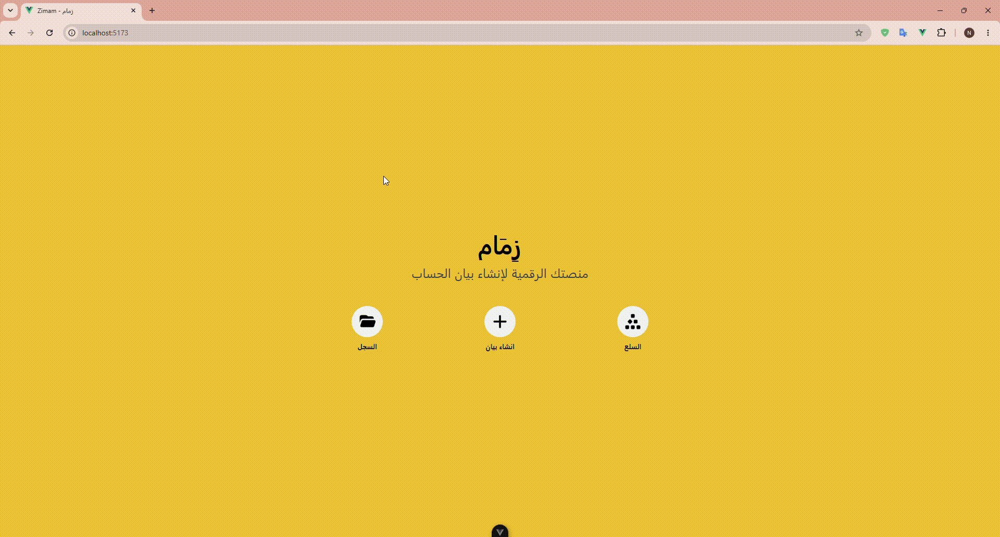

# Zimam - Dashboard

An advanced dashboard for managing products, generating invoices, and archiving them, designed to provide a seamless user experience and print-ready interfaces.

## Screenshots



## Key Features

- **Product Management (CRUD):** Easily add, edit, and delete products.
- **Dynamic Invoice Creation:** Automatically calculate the total as items are added to the invoice.
- **Smart Archive:** Save invoices for future reference, featuring instant search by customer name or invoice number.
- **Print-Friendly Interfaces:** Convert the invoice screen into an official, print-ready document with a single click.

## Tech Stack

- **Framework:** Vue 3 (Composition API) & Vite
- **Styling:** Tailwind CSS v4
- **State Management:** Pinia (Domain-Driven Stores)
- **Routing:** Vue Router (with Lazy Loading)
- **Mock Backend:** JSON-Server for REST API simulation

## Getting Started

To run the project locally on your machine, please follow these steps:

1. **Clone the repository:**

   ```bash
   git clone [https://github.com/nademalossi/zimam.git](https://github.com/nademalossi/zimam.git)

   ```

2. **Navigate to the project directory:**

cd zimam 3. **Install dependencies:**

npm install

4. **Run the project:**

A custom script is set up to run both the frontend server (Vite) and the mock database server (JSON-Server) simultaneously:
npm run dev:all

5. Open your browser and navigate to the link provided in the terminal (usually http://localhost:5173).

## Developer

Nadeem AL-Aloosi
LinkedIn Profile:

GitHub Profile:
